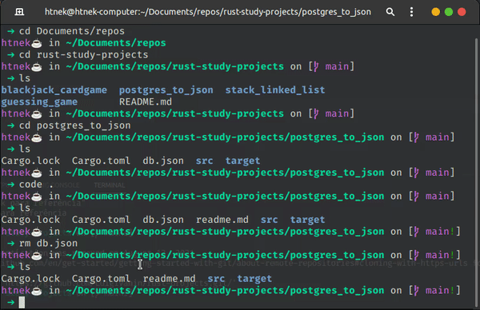

# Postgres to JSON

Uma aplicação simples que converte um banco de dados do tipo postgres para um arquivo no formato json. Cada tabela do seu banco se tornará
objeto contendo uma lista de objetos.

### Preview 👓

<p align="center">

</p>

### Como Rodar 🚀

Com rust instalado na máquina basta rodar o seguinte script para compilar o código:

```bash
> cargo build
```

Para rodar diretamente:

```bash
> cargo run -- <target-file>
```
